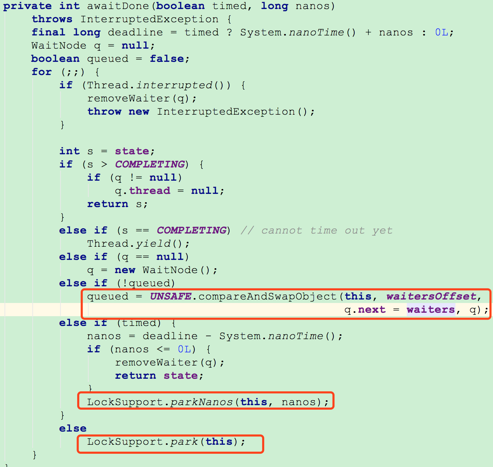
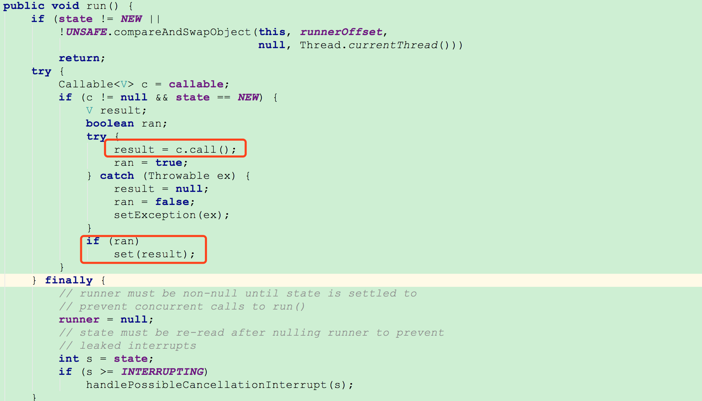
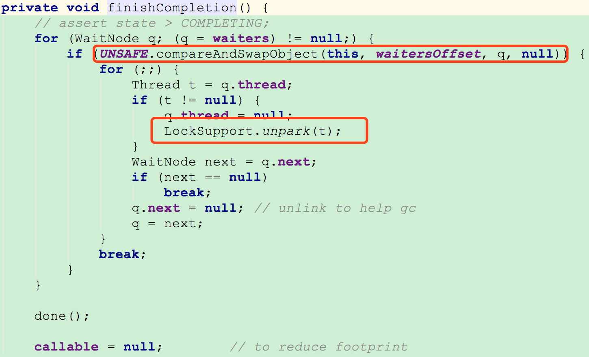
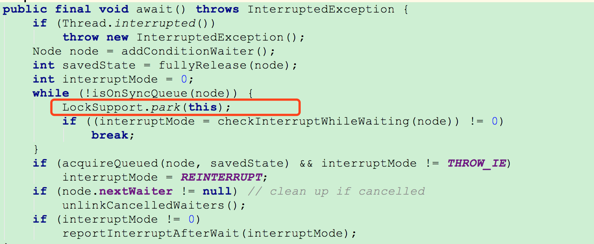
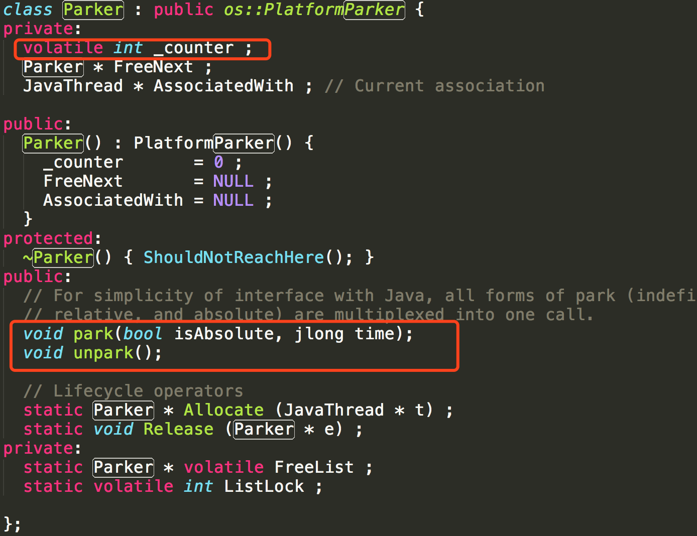
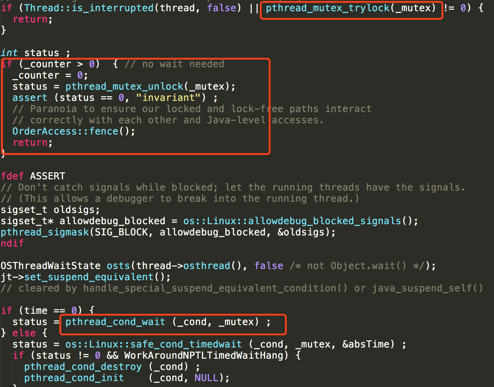
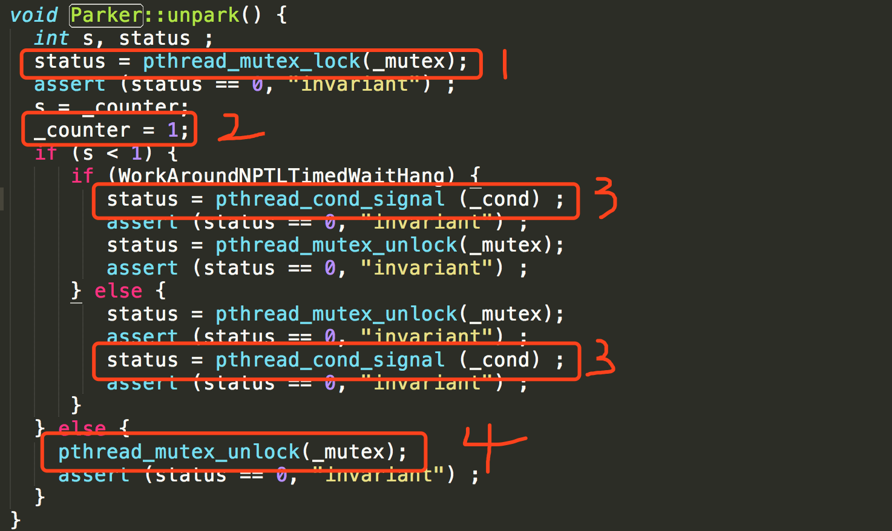

本篇是《自己动手写把"锁"》系列技术铺垫的最后一个知识点。本篇主要讲解LockSupport工具类，它用来实现线程的挂起和唤醒。

LockSupport是Java6引入的一个工具类，它简单灵活，应用广泛。
<!--more--> 
### 一、简单 
俗话说，没有比较就没有伤害。这里咱们还是通过对比来介绍LockSupport的简单。
在没有LockSupport之前，线程的挂起和唤醒咱们都是通过Object的wait和notify/notifyAll方法实现。
写一段例子代码，线程A执行一段业务逻辑后调用wait阻塞住自己。主线程调用notify方法唤醒线程A，线程A然后打印自己执行的结果。

```
public class TestObjWait {

    public static void main(String[] args)throws Exception {
        final Object obj = new Object();
        Thread A = new Thread(new Runnable() {
            @Override
            public void run() {
                int sum = 0;
                for(int i=0;i<10;i++){
                    sum+=i;
                }
                try {
                    obj.wait();
                }catch (Exception e){
                    e.printStackTrace();
                }
                System.out.println(sum);
            }
        });
        A.start();
        //睡眠一秒钟，保证线程A已经计算完成，阻塞在wait方法
        Thread.sleep(1000);
        obj.notify();
    }
}
```

执行这段代码，不难发现这个错误：

```
Exception in thread "main" java.lang.IllegalMonitorStateException
    at java.lang.Object.notify(Native Method)
```

原因很简单，wait和notify/notifyAll方法只能在同步代码块里用(这个有的面试官也会考察)。所以将代码修改为如下就可正常运行了：

```
public class TestObjWait {

    public static void main(String[] args)throws Exception {
        final Object obj = new Object();
        Thread A = new Thread(new Runnable() {
            @Override
            public void run() {
                int sum = 0;
                for(int i=0;i<10;i++){
                    sum+=i;
                }
                try {
                    synchronized (obj){
                        obj.wait();
                    }
                }catch (Exception e){
                    e.printStackTrace();
                }
                System.out.println(sum);
            }
        });
        A.start();
        //睡眠一秒钟，保证线程A已经计算完成，阻塞在wait方法
        Thread.sleep(1000);
        synchronized (obj){
            obj.notify();
        }
    }
}
```

 
那如果咱们换成LockSupport呢？简单得很，看代码：

```
public class TestObjWait {

    public static void main(String[] args)throws Exception {
        Thread A = new Thread(new Runnable() {
            @Override
            public void run() {
                int sum = 0;
                for(int i=0;i<10;i++){
                    sum+=i;
                }
                LockSupport.park();
                System.out.println(sum);
            }
        });
        A.start();
        //睡眠一秒钟，保证线程A已经计算完成，阻塞在wait方法
        Thread.sleep(1000);
        LockSupport.unpark(A);
    }
}
```

直接调用就可以了，没有说非得在同步代码块里才能用。简单吧。

### 二、灵活
如果只是LockSupport在使用起来比Object的wait/notify简单，那还真没必要专门讲解下LockSupport。最主要的是灵活性。
上边的例子代码中，主线程调用了Thread.sleep(1000)方法来等待线程A计算完成进入wait状态。如果去掉Thread.sleep()调用，代码如下：

```
public class TestObjWait {

    public static void main(String[] args)throws Exception {
        final Object obj = new Object();
        Thread A = new Thread(new Runnable() {
            @Override
            public void run() {
                int sum = 0;
                for(int i=0;i<10;i++){
                    sum+=i;
                }
                try {
                    synchronized (obj){
                        obj.wait();
                    }
                }catch (Exception e){
                    e.printStackTrace();
                }
                System.out.println(sum);
            }
        });
        A.start();
        //睡眠一秒钟，保证线程A已经计算完成，阻塞在wait方法
        //Thread.sleep(1000);
        synchronized (obj){
            obj.notify();
        }
    }
}
```

 
多运行几次上边的代码，有的时候能够正常打印结果并退出程序，但有的时候线程无法打印结果阻塞住了。原因就在于：主线程调用完notify后，线程A才进入wait方法，导致线程A一直阻塞住。由于线程A不是后台线程，所以整个程序无法退出。

那如果换做LockSupport呢？LockSupport就支持主线程先调用unpark后，线程A再调用park而不被阻塞吗？是的，没错。代码如下：

```
public class TestObjWait {

    public static void main(String[] args)throws Exception {
        final Object obj = new Object();
        Thread A = new Thread(new Runnable() {
            @Override
            public void run() {
                int sum = 0;
                for(int i=0;i<10;i++){
                    sum+=i;
                }
                LockSupport.park();
                System.out.println(sum);
            }
        });
        A.start();
        //睡眠一秒钟，保证线程A已经计算完成，阻塞在wait方法
        //Thread.sleep(1000);
        LockSupport.unpark(A);
    }
}
```

 
不管你执行多少次，这段代码都能正常打印结果并退出。这就是LockSupport最大的灵活所在。
 
**总结一下，LockSupport比Object的wait/notify有两大优势**：
- LockSupport不需要在同步代码块里 。所以线程间也不需要维护一个共享的同步对象，实现了线程间的解耦。
- unpark函数可以先于park调用，所以不需要担心线程间的执行的先后顺序。
 
### 三、应用广泛
LockSupport在Java的工具类用应用很广泛，咱们这里找几个例子感受感受。以Java里最常用的类ThreadPoolExecutor为例。先看如下代码：

```
public class TestObjWait {

    public static void main(String[] args)throws Exception {
        ArrayBlockingQueue<Runnable> queue = new ArrayBlockingQueue<Runnable>(1000);
        ThreadPoolExecutor poolExecutor = new ThreadPoolExecutor(5,5,1000, TimeUnit.SECONDS,queue);

        Future<String> future = poolExecutor.submit(new Callable<String>() {
            @Override
            public String call() throws Exception {
                TimeUnit.SECONDS.sleep(5);
                return "hello";
            }
        });
        String result = future.get();
        System.out.println(result);
    }
}
```

 代码中我们向线程池中扔了一个任务，然后调用Future的get方法，同步阻塞等待线程池的执行结果。
这里就要问了：**get方法是如何组塞住当前线程？线程池执行完任务后又是如何唤醒线程的呢？**

咱们跟着源码一步步分析，先看线程池的submit方法的实现：


在submit方法里，线程池将我们提交的基于Callable实现的任务，封装为基于RunnableFuture实现的任务，然后将任务提交到线程池执行，并向当前线程返回RunnableFutrue。

进入newTaskFor方法，就一句话：

```
return new FutureTask<T>(callable);
```

所以，咱们主线程调用future的get方法就是FutureTask的get方法，线程池执行的任务对象也是FutureTask的实例。

接下来看看FutureTask的get方法的实现：


比较简单，就是判断下当前任务是否执行完毕，如果执行完毕直接返回任务结果，否则进入awaitDone方法阻塞等待。



awaitDone方法里，首先会用到上节讲到的cas操作，将线程封装为WaitNode，保存下来，以供后续唤醒线程时用。再就是调用了LockSupport的park/parkNanos组塞住当前线程。
 
上边已经说完了阻塞等待任务结果的逻辑，接下来再看看线程池执行完任务，唤醒等待线程的逻辑实现。

前边说了，咱们提交的基于Callable实现的任务，已经被封装为FutureTask任务提交给了线程池执行，任务的执行就是FutureTask的run方法执行。如下是FutureTask的run方法：



c.call()就是执行我们提交的任务，任务执行完后调用了set方法，进入set方法发现set方法调用了finishCompletion方法，想必唤醒线程的工作就在这里边了，看看代码实现吧：



没错就在这里边，先是通过cas操作将所有等待的线程拿出来，然后便使用LockSupport的unpark唤醒每个线程。
 
在使用线程池的过程中，不知道你有没有这么一个疑问：线程池里没有任务时，线程池里的线程在干嘛呢？

看过我的这篇文章《线程池的工作原理与源码解读》的读者一定知道，线程会调用队列的take方法阻塞等待新任务。那队列的take方法是不是也跟Future的get方法实现一样呢？咱们来看看源码实现。

以ArrayBlockingQueue为例，take方法实现如下：


与想象的有点出入，他是使用了Lock的Condition的await方法实现线程阻塞。但当我们继续追下去进入await方法，发现还是使用了LockSupport：



限于篇幅，jdk里的更多应用就不再追下去了。
 
### 四、LockSupport的实现
学习要知其然，还要知其所以然。接下来不妨看看LockSupport的实现。

进入LockSupport的park方法，可以发现它是调用了Unsafe的park方法，这是一个本地native方法，只能通过openjdk的源码看看其本地实现了：


它调用了线程的Parker类型对象的park方法，如下是Parker类的定义：



类中定义了一个int类型的_counter变量，咱们上文中讲灵活性的那一节说：可以先执行unpark后执行park，就是通过这个变量实现。看下park方法的实现代码(由于方法比较长就不整体截图了)：


park方法会调用Atomic::xchg方法，这个方法会原子性的将_counter赋值为0，并返回赋值前的值。如果调用park方法前，_counter大于0，则说明之前调用过unpark方法，所以park方法直接返回。
接着往下看：



实际上Parker类用Posix的mutex，condition来实现的阻塞唤醒。如果对mutex和condition不熟，可以简单理解为mutex就是Java里的synchronized，condition就是Object里的wait/notify操作。

park方法里调用pthread_mutex_trylock方法，就相当于Java线程进入Java的同步代码块，然后再次判断_counter是否大于零，如果大于零则将_counter设置为零。最后调用pthread_mutex_unlock解锁，相当于Java执行完退出同步代码块。如果_counter不大于零，则继续往下执行pthread_cond_wait方法，实现当前线程的阻塞。
 
最后再看看unpark方法的实现吧，这块就简单多了，直接上代码：



图中的1和4就相当于Java的进入synchronized和退出synchronized的加锁解锁操作，代码2将_counter设置为1，同时判断先前_counter的值是否小于1，即这段代码：if(s<1)。如果不小于1，则就不会有线程被park，所以方法直接执行完毕，否则就会执行代码3，来唤醒被阻塞的线程。
 
通过阅读LockSupport的本地实现，我们不难发现这么个问题：多次调用unpark方法和调用一次unpark方法效果一样，因为都是直接将_counter赋值为1，而不是加1。简单说就是：线程A连续调用两次LockSupport.unpark(B)方法唤醒线程B，然后线程B调用两次LockSupport.park()方法， 线程B依旧会被阻塞。因为两次unpark调用效果跟一次调用一样，只能让线程B的第一次调用park方法不被阻塞，第二次调用依旧会阻塞。
 
到这里,自己实现一把“锁”用到的技术点都已经介绍完了，甚至本节还介绍了锁的具体实现，相信即使没有最后一篇介绍怎么实现“锁”，大家也能动手写个锁了。